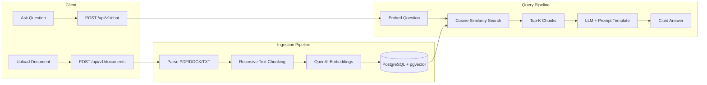

# RAG Pipeline

[](https://www.python.org/downloads/)
[](https://fastapi.tiangolo.com)
[](https://www.langchain.com)
[](LICENSE)

> Production-ready Retrieval-Augmented Generation API -- upload documents, ask questions, get cited answers.

A complete RAG system built with **FastAPI**, **LangChain**, **PostgreSQL + pgvector**, and **OpenAI**. Upload PDF, DOCX, or TXT files; the pipeline chunks, embeds, and stores them. Then ask natural language questions and receive grounded answers with source citations.

*[Leia em Portugues](#portugues)*

---

## Table of Contents

- [Architecture](#architecture)
- [Features](#features)
- [Tech Stack](#tech-stack)
- [Quick Start](#quick-start)
- [API Reference](#api-reference)
- [Project Structure](#project-structure)
- [Development](#development)
- [Configuration](#configuration)
- [Roadmap](#roadmap)
- [License](#license)

---

## Architecture



---

## Features

- **Multi-format ingestion** -- PDF, DOCX, TXT, and Markdown
- **Configurable chunking** -- Recursive character or token-based strategies
- **Vector search** -- pgvector cosine similarity with configurable threshold
- **Citation support** -- Answers include source document, page number, and relevance score
- **Scoped queries** -- Filter retrieval to specific documents
- **Fully asynchronous** -- SQLAlchemy async engine, FastAPI async endpoints
- **One-command setup** -- `docker compose up` and the full stack is running
- **CI/CD ready** -- GitHub Actions pipeline with lint, test, and Docker build stages

---

## Tech Stack

| Layer | Technology |
|-------|------------|
| API Framework | FastAPI + Pydantic v2 |
| LLM Orchestration | LangChain 0.3 |
| Embeddings | OpenAI `text-embedding-3-small` |
| LLM | OpenAI `gpt-4o-mini` (configurable) |
| Vector Store | PostgreSQL 16 + pgvector |
| ORM | SQLAlchemy 2.0 (async) |
| Document Parsing | PyPDF, python-docx, Unstructured |
| Testing | pytest + pytest-asyncio + httpx |
| Linting | Ruff |
| Containerization | Docker + Docker Compose |

---

## Quick Start

### Prerequisites

- Docker and Docker Compose
- An OpenAI API key

### 1. Clone and configure

```bash
git clone https://github.com/reiquileut/rag-pipeline.git
cd rag-pipeline
cp .env.example .env
# Edit .env and set your OPENAI_API_KEY
```

### 2. Start the stack

```bash
docker compose up -d
```

This starts PostgreSQL with pgvector and the FastAPI application. The API will be available at `http://localhost:8000`.

### 3. Explore the API

Open **http://localhost:8000/docs** for the interactive Swagger UI.

### 4. Upload a document

```bash
curl -X POST http://localhost:8000/api/v1/documents \
  -F "file=@my_document.pdf"
```

### 5. Ask a question

```bash
curl -X POST http://localhost:8000/api/v1/chat \
  -H "Content-Type: application/json" \
  -d '{"question": "What are the main findings?"}'
```

Example response:

```json
{
  "answer": "The main findings indicate that... [Source 1] [Source 2]",
  "citations": [
    {
      "document_id": "550e8400-e29b-41d4-a716-446655440000",
      "filename": "my_document.pdf",
      "chunk_index": 3,
      "content_preview": "The study concludes that...",
      "page_number": 7,
      "similarity_score": 0.9234
    }
  ],
  "model": "gpt-4o-mini"
}
```

---

## API Reference

| Method   | Endpoint                   | Description                     |
|----------|----------------------------|---------------------------------|
| `GET`    | `/health`                  | Health check with DB status     |
| `POST`   | `/api/v1/documents`        | Upload and ingest a document    |
| `GET`    | `/api/v1/documents`        | List all documents              |
| `GET`    | `/api/v1/documents/{id}`   | Get document details            |
| `DELETE` | `/api/v1/documents/{id}`   | Delete document and its chunks  |
| `POST`   | `/api/v1/chat`             | Ask a question with citations   |

---

## Project Structure

```
rag-pipeline/
├── app/
│   ├── api/routes/              # FastAPI route handlers
│   │   ├── chat.py              # Q&A endpoint
│   │   ├── documents.py         # Upload, list, delete
│   │   └── health.py            # Health check
│   ├── core/                    # Business logic
│   │   ├── chain.py             # LangChain RAG chain
│   │   ├── chunking.py          # Text splitting strategies
│   │   ├── embeddings.py        # OpenAI embedding generation
│   │   ├── ingestion.py         # Document parsing (PDF/DOCX/TXT)
│   │   └── retriever.py         # pgvector similarity search
│   ├── db/
│   │   ├── database.py          # Async engine and session factory
│   │   └── vector_store.py      # SQLAlchemy models with pgvector
│   ├── models/
│   │   └── schemas.py           # Pydantic request/response schemas
│   ├── config.py                # Settings loaded from environment
│   └── main.py                  # Application entrypoint
├── tests/
│   ├── test_api/                # Endpoint integration tests
│   └── test_core/               # Unit tests (chunking, ingestion)
├── .github/workflows/ci.yml     # GitHub Actions CI pipeline
├── docker-compose.yml           # Full stack orchestration
├── Dockerfile                   # Multi-stage container build
├── Makefile                     # Development shortcuts
├── requirements.txt             # Python dependencies
└── pyproject.toml               # Project metadata and tool config
```

---

## Development

### Local setup (without Docker)

```bash
python -m venv .venv
source .venv/bin/activate
pip install -r requirements.txt

# Start PostgreSQL with pgvector locally, then:
uvicorn app.main:app --reload
```

### Running tests

```bash
make test
# or directly:
pytest -v --tb=short
```

### Linting and formatting

```bash
make lint    # check for issues
make fmt     # auto-fix formatting
```

---

## Configuration

All settings are loaded from environment variables. See `.env.example` for the full list.

| Variable               | Default                    | Description                        |
|------------------------|----------------------------|------------------------------------|
| `OPENAI_API_KEY`       | --                         | Your OpenAI API key                |
| `LLM_MODEL`           | `gpt-4o-mini`              | Chat model for answer generation   |
| `EMBEDDING_MODEL`     | `text-embedding-3-small`   | Embedding model                    |
| `CHUNK_SIZE`           | `1000`                     | Characters per chunk               |
| `CHUNK_OVERLAP`        | `200`                      | Overlap between consecutive chunks |
| `RETRIEVAL_TOP_K`      | `5`                        | Number of chunks to retrieve       |
| `SIMILARITY_THRESHOLD` | `0.7`                      | Minimum cosine similarity score    |
| `MAX_UPLOAD_SIZE_MB`   | `50`                       | Maximum upload file size in MB     |

---

## Roadmap

- [ ] Streaming responses via Server-Sent Events (SSE)
- [ ] Multi-model support (Anthropic Claude, local models via Ollama)
- [ ] Hybrid search (BM25 + vector)
- [ ] Conversation memory with LangGraph
- [ ] Reranking with Cohere or cross-encoder models
- [ ] Web UI with Streamlit
- [ ] Alembic migrations for schema versioning

---

## License

This project is licensed under the [MIT License](LICENSE).

---

<a id="portugues"></a>

## Portugues

Pipeline RAG completo e pronto para producao. Faca upload de documentos (PDF, DOCX, TXT), pergunte em linguagem natural e receba respostas fundamentadas com citacoes das fontes.

**Stack:** FastAPI, LangChain, PostgreSQL + pgvector, OpenAI

**Como rodar:**

```bash
git clone https://github.com/reiquileut/rag-pipeline.git
cd rag-pipeline
cp .env.example .env  # adicione sua OPENAI_API_KEY
docker compose up -d
# Acesse http://localhost:8000/docs
```
